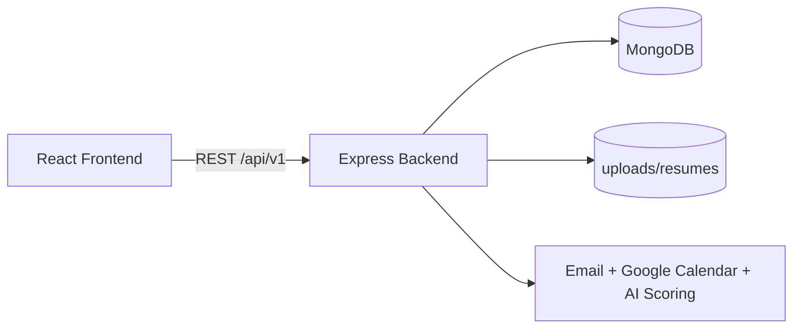

# HireMatrix

HireMatrix is a full-stack recruitment management platform that centralizes the complete hiring lifecycle, from job creation to final hiring decision.

It is designed for role-based collaboration between admins, recruiters, hiring managers, interviewers, and applicants.

## What This Project Does

- Manage job postings and hiring teams
- Manage candidates, profiles, and resume uploads
- Track applications through a controlled pipeline
- Schedule interviews and collect interviewer feedback
- Record final decisions (pending, selected, rejected)
- Send in-app and email notifications
- Export hiring data for reporting

## Tech Stack

### Backend

- Node.js
- Express 5
- MongoDB + Mongoose
- Zod validation
- JWT authentication
- Multer file uploads
- Nodemailer
- Google APIs (Calendar/Meet)
- @google/genai for AI scoring

### Frontend

- React 19
- Vite 8
- React Router
- Tailwind CSS v4
- dnd-kit (pipeline drag and drop)
- lucide-react
- class-variance-authority + clsx + tailwind-merge

## Architecture Overview



## Repository Structure

```text
HireMatrix/
  backend/        # Express API + MongoDB models + services
  frontend/       # React app (Vite)
  PROJECT_BACKGROUND_AND_IMPLEMENTATION_GUIDE.md
  VIVA_QUESTIONS_AND_ANSWERS_SIMPLE.md
```

## Quick Start

## 1. Prerequisites

- Node.js 18+
- npm 9+
- MongoDB running locally or remotely

## 2. Backend Setup

```bash
cd backend
npm install
```

Create backend/.env with at least these values:

```env
PORT=4000
MONGO_URI=mongodb://127.0.0.1:27017/hirematrix
CORS_ORIGIN=http://localhost:5173
JWT_SECRET=change-me-access-secret
JWT_REFRESH_SECRET=change-me-refresh-secret
ADMIN_EMAIL=admin@hirematrix.local
ADMIN_PASSWORD=ChangeMe123!
APP_FRONTEND_URL=http://localhost:5173
```

Run backend:

```bash
npm run dev
```

Backend base URL: http://localhost:4000

## 3. Frontend Setup

```bash
cd frontend
npm install
```

Optional frontend environment:

```env
VITE_API_URL=http://localhost:4000/api/v1
```

If VITE_API_URL is not set, the app defaults to /api/v1.

Run frontend:

```bash
npm run dev
```

Frontend URL: http://localhost:5173

## 4. Build

Frontend production build:

```bash
cd frontend
npm run build
```

Backend production start:

```bash
cd backend
npm start
```

## API Surface

All backend routes are mounted under /api/v1.

Main route groups:

- /health
- /auth
- /admin
- /jobs
- /candidates
- /applications
- /applicant
- /interviews
- /dashboard
- /exports
- /notifications

## Role Model

- admin
- recruiter
- hiring_manager
- interviewer
- applicant

Both backend and frontend enforce role-based access.

## Hiring Decision States

The final decision model is simplified to:

- pending
- selected
- rejected


## License

This project currently uses the ISC license in backend/package.json.
